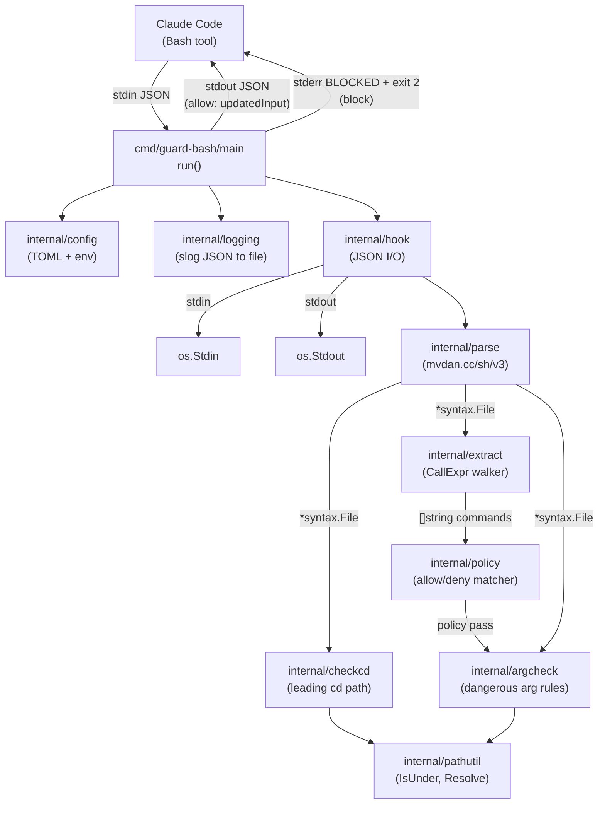

# Architecture

guard-bash は Claude Code の `PreToolUse` フックとして Bash ツール呼び出しを検証する単一バイナリ。
内部は Go の小さな internal パッケージ群で構成する。

## コンポーネント図

## データフロー

1. `config.Load()` で embedded default.toml + ユーザ TOML + 環境変数をマージした `*Config` を作る
1. `logging.Init()` で slog JSON handler をファイル出力用に初期化
1. `hook.Read(stdin)` で Claude Code の PreToolUse payload (`cwd`, `tool_input.command`, `tool_input.description`) を取得
1. `exec.Command("git", "-C", cwd, "rev-parse", "--git-dir")` で cwd が git 管理下か確認
1. `parse.Parse(command)` で `*syntax.File` を取得(`mvdan.cc/sh/v3/syntax` は shfmt のパーサ本体)
1. `extract.Commands(file)` で `syntax.Walk` を使い全 `*syntax.CallExpr`を訪問、各ノードから静的解決できるコマンド名を抽出
1. `policy.New(...).Check(commands)` で denylist / allowlist と突合。最初の非 allow で即 return
1. `argcheck.New(disabled).Check(file, ctx)` で許可コマンドの危険な引数パターンを検査
   (rm -rf /, git push --force main, curl | bash 等)
1. `checkcd.Check(file, cwd, allowed_dirs)` で先頭 Stmt の leftmost 子が `cd <static-path>` であれば、
   そのパスが許可 dir 配下か検証
1. allow の場合は `hook.WriteAllow(stdout, fixed, desc)` で `updatedInput.command` を stdout に書き出す

## AST 走査の要点

`mvdan.cc/sh/v3/syntax.Walk` は `*syntax.File` 以下の全 Node を訪問する。
`*syntax.CallExpr` を拾えば以下が自動的に全てカバーされる:

- BinaryCmd (`&&` `||` `|` `;`)
- ForClause / WhileClause / UntilClause / IfClause / CaseClause
- Subshell / Block / FuncDecl / TimeClause / CoprocClause
- Word の Parts に含まれる CmdSubst (`$(...)` / `` `...` `` ) / ProcSubst
- DeclClause (`export`/`local`/`declare`) の Value 内 CmdSubst

`TimeClause` 自体は CallExpr ではないため、`time` コマンドを明示的に走査する必要はない (内側の Stmt が独立して訪問される)。

## 静的/動的な Word の判定

`extract.fromCallExpr` は `parse.WordLiteral` を通じて Word の Parts を解析する:

- `Lit` / `SglQuoted` / `DblQuoted` 内の `Lit` のみを連結し静的文字列に
- `ParamExp` / `CmdSubst` / `ArithmExp` / `ProcSubst` のいずれかが含まれる
  Word は「動的」と判定し `extract.Dynamic` (`__DYNAMIC__`) を emit
- 動的なコマンド名は `policy.Check` で常にブロックされる

## Wrapper コマンドの扱い

`env` / `command` / `nice` / `nohup` が先頭にある CallExpr は、続く引数を走査して実コマンド名を追加で抽出する。
具体的には `env` の `KEY=VALUE` と `-flag` 形式をスキップし、最初の非代入・非フラグ引数を採用する。

> [!NOTE]
> `env -u VAR CMD` のような `-flag ARG` 形式は単純化のため正しく扱えない。
> `command -v git` は `command` と `git` 両方を emit するため、`git` が
> allowlist に無い状況では誤ブロックとなる可能性がある。

## 引数チェック (argcheck)

`argcheck.Checker` は `policy.Check` を通過したコマンドに対して、引数レベルの危険パターンを検出する。
各ルールは Go 関数として実装され、ルール ID で個別に無効化できる。

AST を独立に `syntax.Walk` し、`CallExpr` の引数や `BinaryCmd` (パイプ) の構造を検査する。
`parse.WordLiteral` で静的解決できる引数のみを対象とし、動的引数は検査しない (コマンド名レベルで既にブロック済み)。

ヘルパー関数:

- `hasShortFlag`: マージフラグ (`-rf`) に対応。`--` 以降は無視
- `isBroadPath`: `/`, `~`, `.`, `..`, `/home` 等を広範パスと判定
- `nonFlagArgs`: フラグ以外の位置引数を抽出

パス系ルール (`git-dir-escape`, `make-dir-escape`) は `pathutil.Resolve` と `pathutil.IsUnder` を使って
CWD 外かどうかを判定する。

## `cd` 先頭判定の詳細

`checkcd.Check` は `file.Stmts[0].Cmd` の `BinaryCmd` leftmost を降りて CallExpr を取得し、以下のように判定する:

| 状態                           | Verdict        | エラー              |
| ------------------------------ | -------------- | ------------------- |
| 先頭が cd ではない             | `NeedsPrepend` | nil                 |
| `cd <static-path>` かつ配下 OK | `AlreadyOK`    | nil                 |
| `cd <static-path>` 配下外      | `NeedsPrepend` | `ErrOutsideAllowed` |
| `cd` に引数なし / `cd "$VAR"`  | `NeedsPrepend` | `ErrDynamicTarget`  |

許可 dir のセットは以下を union したもの。`filepath.EvalSymlinks` で正規化してから `filepath.Rel` で配下チェックする。

- `cwd` (hook payload)
- `checkcd.allowed_dirs` (TOML)
- `GUARD_ALLOWED_DIRS` (env var, `:` 区切り)

<!-- EOF -->
